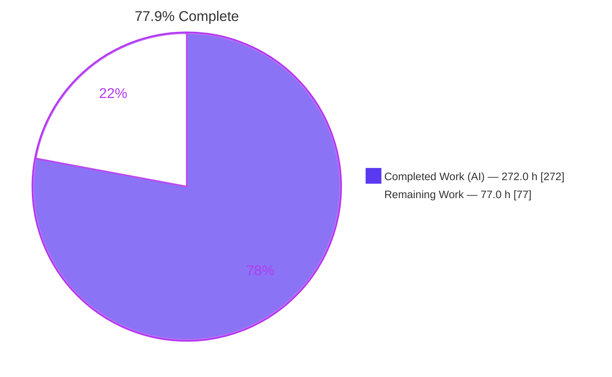
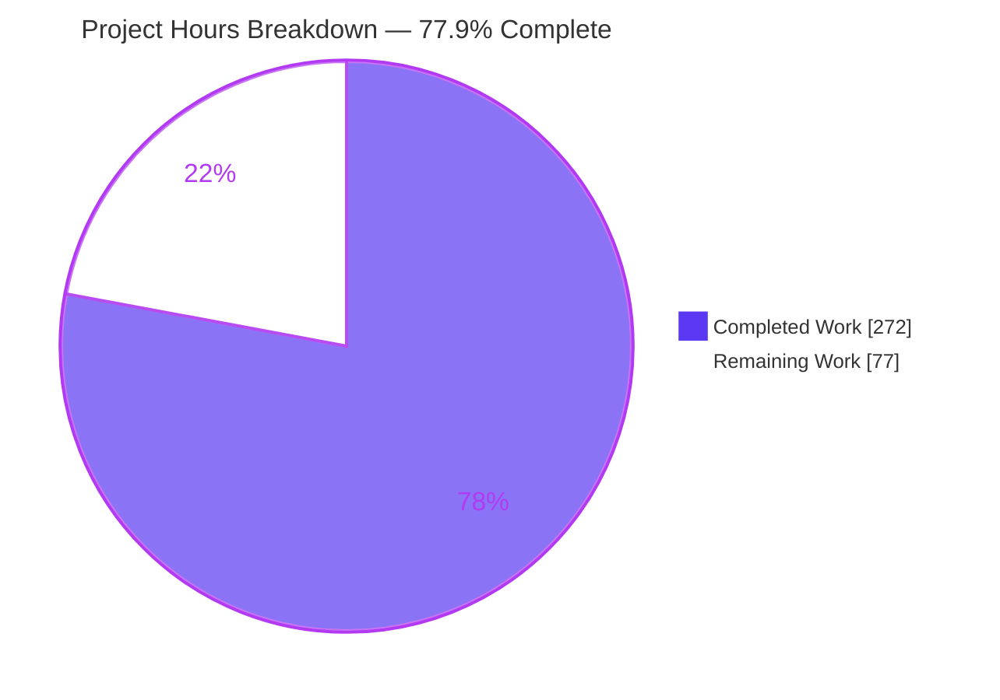
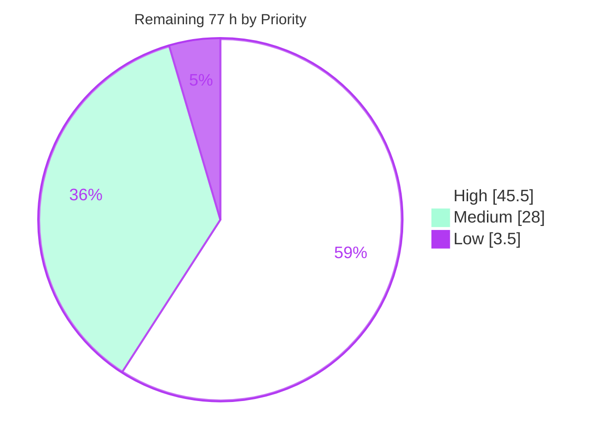
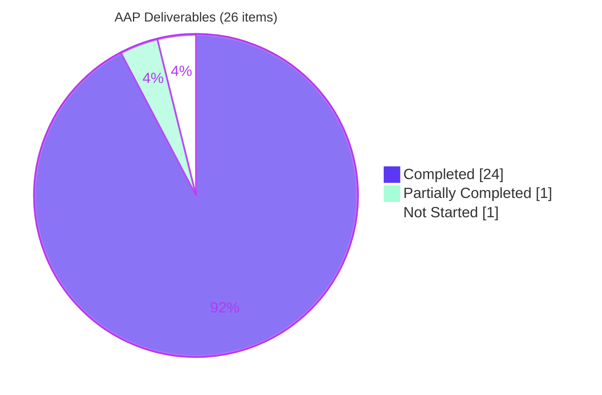

# Blitzy Project Guide

**Project:** `tlsfuzzer/python-ecdsa` — Minerva-class timing side-channel remediation (CVE-2024-23342)
**Branch:** `blitzy-7c2b0b0f-9149-449f-8bc7-0557bdff55b0` · **HEAD:** `2312248` · **Base:** `55aca78` (`python-ecdsa-0.19.1-2-g55aca78`)
**Working tree:** `/tmp/blitzy/python-ecdsa/blitzy-7c2b0b0f-9149-449f-8bc7-0557bdff55b0_de47a9`

---

## 1. Executive Summary

### 1.1 Project Overview

This engagement remediates **CVE-2024-23342** (GHSA-wj6h-64fc-37mp, PYSEC-2026-1325, CVSS 3.1 **7.4 HIGH**), a Minerva-class timing side channel in the pure-Python `ecdsa` library: signing duration tracked the secret per-signature nonce, letting a remote attacker recover the long-term private key via Hidden Number Problem lattice techniques. Because the advisory lists every release as affected and **none as patched**, this repository *is* the patch. The work makes the number of elliptic-curve point operations a function of the public curve parameters alone, across signing, key generation, ECDH and EdDSA, while leaving emitted signatures byte-identical, the public API untouched and the package free of native code. Beneficiaries are every consumer signing with a fixed key over a network-reachable oracle.

### 1.2 Completion Status



| Metric | Value |
|---|---|
| **Total Hours** | **349.0 h** |
| **Completed Hours (AI + Manual)** | **272.0 h** (272.0 h autonomous AI · 0.0 h manual) |
| **Remaining Hours** | **77.0 h** |
| **Percent Complete** | **77.9 %** |

**Calculation (PA1, AAP-scoped only):** `272.0 / (272.0 + 77.0) × 100 = 272.0 / 349.0 = 77.9 %`
The work universe is the 26 deliverables explicitly defined in the Agent Action Plan (285.5 h) plus 10 standard path-to-production activities required to deploy them (63.5 h). Nothing outside that scope is counted.

**Legend** — <span style="color:#5B39F3">■</span> Completed / AI Work = Dark Blue `#5B39F3` · <span style="color:#FFFFFF">□</span> Remaining = White `#FFFFFF`

### 1.3 Key Accomplishments

- [x] **The leak carrier is eliminated and independently re-measured.** Instrumenting `_add`/`_double` gives **exactly one addition count and zero doublings on all 26 registered curves** (NIST192p 49 · NIST224p 57 · **NIST256p 65** · NIST384p 97 · NIST521p 131 · SECP256k1 65 · SECP112r1 29 · SECP112r2 28 · SECP128r1 33 · SECP160r1 41 · Ed25519 64 · Ed448 112 · Brainpool 41→129), every value matching the plan's predicted width-4 comb count. The base tree shows **64 distinct counts spanning 2–94 on NIST256p alone**, a 92-addition monotone leak.
- [x] **All seven planned defects addressed at 14 sites.** Padding cancellation removed at source, the digit-conditional ladder replaced by a fixed-count signed comb, the non-precomputed (ECDH) path bounded by the curve, early exits moved behind canonicalisation, the legacy affine ladder re-sized, the modular inverse blinded, and `_add`'s formula dispatch made positional.
- [x] **ECDH — which leaks the *long-term* key — hardened for both peer-point shapes.** NIST256p: **72 additions / 257 doublings** against an order-carrying peer and **73 / 257** against a peer decoded from an encoding, both constant, versus 16–18 distinct addition counts and 8–11 distinct doubling counts on base.
- [x] **Signatures are byte-identical to the unpatched build** — 66/66 trials across 11 curves, zero mismatches — because adding a multiple of the order leaves the point unchanged. RFC 6979 determinism holds byte-for-byte.
- [x] **Public API and serialisation provably unchanged.** 346 public callables and **259 Sphinx-documented signatures are identical sets** base vs branch (0 removed, 0 added, 0 signature changes). Confirmed a third time in a real browser.
- [x] **Verification path untouched by construction.** `PointJacobi.mul_add`, `Public_key.verifies`, `AbstractPoint._naf`, `__getstate__` and all seven `_add*`/`_double*` formula bodies are **AST-identical** to base. Verify throughput 0.997×.
- [x] **The library gains its first side-channel regression tests** — `src/ecdsa/test_side_channel.py`, 173 deterministic exact-value tests in 15 classes. **124 of them fail on the pristine base tree**, making them evidence of a defect rather than a description of the fix.
- [x] **Suite green on five interpreter/backend combinations**, grown 2,020 → **2,322** tests: 2,316 P / 6 S / **0 F** on CPython 3.12.13; 2,318 P / 4 S / 0 F on 3.11 + gmpy2 and on 3.10 + gmpy.
- [x] **Every CI gate cleared.** `flake8` exit 0 · `black --check --line-length 79 .` "36 files would be left unchanged" · branch coverage `ecdsa.py` **100 %** and `ellipticcurve.py` **98 %** against a 70 % floor · mutation survival **4.58 %** over 1,616 executed mutants against a 50 % limit (also passes at `--fail-over 5`).
- [x] **Still pure Python, still zero-dependency.** `py2.py3-none-any` wheel, `Root-Is-Purelib: true`, **zero native entries** in wheel and sdist. Manifest diff is empty. `vermin` reports "Minimum required versions: 2.6, 3.0".
- [x] **Documentation is honest.** Every "constant-time" mention in `SECURITY.md`/`README.md`/`NEWS` is a *disclaimer*; residual risks are disclosed by name, including that scanners will keep flagging the version.

### 1.4 Critical Unresolved Issues

| Issue | Impact | Owner | ETA |
|---|---|---|---|
| **No human cryptographic peer review** of the 1,041 net new lines of scalar-multiplication arithmetic and the blinded inversion | **Release-blocking.** Automated evidence is strong (4.58 % mutation survival, 173 exact-value tests, 66/66 byte-identical signatures) but no correctness argument for a crypto primitive should ship unreviewed | Cryptography engineer / security reviewer | 16 h |
| **Wall-clock arm of the acceptance criterion unproven.** `minerva_probe.py` reports "not detected" on the **vulnerable base tree too** on the available host — per-bucket SE is 11–12 µs against a ~2 µs `sign_digest()` effect at N ≤ 20,000 | Cannot yet state the leak-reduction *magnitude* the grading criterion asks for. The operation-count proof is decisive and is the actual carrier, but the statistical verdict is outstanding | Performance/security engineer with a quiet dedicated host | 9 h |
| **External `tlsfuzzer` harness confirmation never run** (return code must move 1 → 0) | The canonical third-party acceptance test is unexecuted; needs a TLS 1.3 server, a network interface, root for `tcpdump --time-stamp-precision nano` and `--repeat 100000` | Security engineer | 12 h |
| **New-format pickle read by old code unpickles without error and computes the WRONG point** (proven empirically; old `__setstate__` was a bare `dict.update` with no shape validation) | Silent incorrectness during any rolling upgrade that shares a pickled precompute cache between old and new workers | Release engineer | 3 h |
| **Python 2.6 / 2.7 legs have never executed** — only static `vermin` conformance | The declared support floor is unverified at runtime; the py2.6 CI leg bypasses `tox` entirely | CI owner | included in the 8.5 h matrix run |
| **CVE-2026-33936** (DER length-validation DoS, MODERATE) is still live in this checkout — reproduced: `remove_octet_string(b"\x04\x82\x10\x00"+b"ABC")` returns a 3-byte body against a declared 4096 | A second known vulnerability ships alongside the fix. Deliberately out of scope per the plan's confinement constraint | Maintainer | 3 h (separate change) |
| **Throughput is at parity (0.978×), not the predicted 26 % gain**, while the precompute table doubles (259 → 520 entries; first use 6.9 → 15.7 ms on P-256, 32.2 → 74.5 ms on P-521) | The plan's "break-even at ~81 signatures" does not hold on the measured host; the memory and first-use cost are net | Performance engineer | 3 h |

### 1.5 Access Issues

No access issue blocked any part of the autonomous build, test, lint, coverage, mutation, documentation or packaging chain — all of it completed locally with no credential, service, database, container or network dependency. The items below are **capability/environment constraints** that prevented three specific *verification* activities and are therefore recorded rather than omitted.

| System / Resource | Type of Access | Issue Description | Resolution Status | Owner |
|---|---|---|---|---|
| `tlsfuzzer/tlsfuzzer` external harness | Repository clone + **root** + a live network interface | `scripts/test-tls13-minerva.py` is not in this checkout; it drives a TLS 1.3 server over a real interface and shells out to `tcpdump -s 0 --time-stamp-precision nano`, which requires root | **Not resolved** — substituted by the in-repo `minerva_probe.py`, which reproduces the same four-test Bonferroni-corrected methodology | Security engineer |
| Quiet, dedicated measurement host | Bare metal / pinned CPU, no SMT, no frequency scaling | Timing jitter on the shared container (SE 11–12 µs) exceeds the ~2 µs effect, so the statistical arm cannot discriminate base from branch here | **Not resolved** — needs dedicated hardware | Performance engineer |
| GitHub Actions runners | CI execution | The ~23-configuration matrix, including the Python 2.6 / 2.7 / 3.5–3.9 / PyPy legs and the `instrumental` condition-coverage leg, cannot run in this environment (no py2.x interpreter; `instrumental` predates the Python 3.8 AST) | **Not resolved** — 4 interpreters × 3 integer backends validated locally as a proxy | CI owner |
| PyPI / release credentials | Publish token | Not required for this deliverable; no release was attempted. Artifacts build reproducibly (`ecdsa-0.19.1+7.g2312248-py2.py3-none-any.whl`) | **Not required yet** | Release engineer |
| Git identity | Commit authorship | Already correct — all 5 commits authored **and** committed as `Blitzy Agent <agent@blitzy.com>`; `git config` was never invoked | **Resolved** | — |
| Source repository, `/opt/venvs` toolchain, system OpenSSL 3.5.3 | Read/write, execute | Full access confirmed; the OpenSSL interoperability test class genuinely executes | **Resolved** | — |

### 1.6 Recommended Next Steps

1. **[High]** Commission the **cryptographic peer review** (16 h). Hand the reviewer the six-point checklist in §9.7: recoding reconstruction, canonicalisation range and parity, blinding cancellation, entropy-failure translation, the `self.__order` fall-through, and comb-table shape validation.
2. **[High]** Run the **statistical leak-reduction campaign on a quiet, dedicated host** (9 h) — `minerva_probe.py` against *both* this branch and a `55aca78` checkout, scanning N up to 10⁷. This produces the leak-reduction magnitude the grading criterion rewards and closes the one acceptance criterion still open.
3. **[High]** Execute the **external `tlsfuzzer` confirmation** (12 h) and record the return-code flip from 1 to 0 with its confidence-interval plots.
4. **[High]** Push the branch and let the **full ~23-configuration CI matrix** run (8.5 h), especially the never-executed Python 2.6 and 2.7 legs and the six gmpy/gmpy2 legs.
5. **[Medium]** Publish the **pickle forward-compatibility note** (3 h) *before* any deployment that shares a precompute cache — the new→old direction silently returns wrong points — and **cherry-pick upstream `bd66899`** for CVE-2026-33936 as a separate reviewable change (3 h).

---

## 2. Project Hours Breakdown

### 2.1 Completed Work Detail

| Component | Hours | Description |
|---|---|---|
| Vulnerability research, CVE/advisory identification & dependency sweep | 16.0 | CVE-2024-23342 ≡ GHSA-wj6h-64fc-37mp ≡ PYSEC-2026-1325 identified with CVSS 7.4 vector and CWE-203/208/385; OSV sweep across 20 dependency targets (zero findings against shipped deps); precedent literature (Minerva TCHES 2020, "Déjà Vu" nonce-unpadding arXiv:2008.06004, GnuTLS CVE-2024-28834 fix shape, Coron CHES'99, OWASP ASVS 6.2.8) |
| Defect localisation: 7 defects at 14 sites + baseline measurement | 12.0 | Every defect pinned to `file:line` across four scalar-multiplication paths; per-curve cancellation-probability table for all 26 curves; baseline operation-count distributions recorded |
| Countermeasure selection benchmark: w=1/3/4/5 prototypes | 10.0 | Four candidate recodings built and benchmarked against the real NIST256p curve; width 4 selected on measured evidence (65 constant additions) with w=3 retained as a documented fallback |
| CC-1 Fixed-window signed-digit recoder + 12 canonicalisation helpers | 20.0 | `_fixed_digits`, `_fixed_window`, `_fixed_digit_count`, `_fixed_table_length`, `_fixed_table_shaped`, `_fixed_ladder_usable`, `_curve_*`, `_canonical_scalar`, `_integer_multiplier` added to `AbstractPoint`; `_naf` retained AST-identical for the verification path |
| CC-2 Branch-free odd canonicalisation + early-exit reorder (Jacobi + Edwards) | 10.0 | `other % (order*2)` replaced by `k % n + n*(1 + (k&1))` — odd, in `[n, 3n)`, valid because all 26 curve orders are odd; guards now evaluate the canonical value |
| CC-3 Width-4 signed comb precompute table + `_scaled_all` (Jacobi + Edwards) | 12.0 | Table rebuilt from 259 doubling entries to 520 comb entries on P-256, with the shape recorded so unpickling can validate it |
| CC-4 Fixed-count `_mul_precompute` ladder (Jacobi + Edwards) | 14.0 | Exactly one `_add` per recoded digit, sign applied by negating the table entry's `Y`; the digit-conditional branch that made the addition count equal the NAF Hamming weight is gone |
| CC-5 Fixed-count non-precomputed ladder incl. orderless-peer ECDH | 16.0 | `_mul_fixed`, `_mul_curve_fixed`, `_mul_fixed_digits`, `_curve_fixed_usable`; the ECDH path is bounded by the curve's field via Hasse's theorem when the peer point carries no order |
| CC-6 Legacy affine `Point.__mul__` rewrite | 6.0 | `leftmost_bit`/`e3 = 3*e` magnitude sizing removed in favour of a count derived from the curve order |
| CC-7 Shape-validating pickle state on PointJacobi and PointEdwards | 5.0 | `__setstate__` now discards a mismatched cached table and lets the lazy path rebuild; `__getstate__` untouched so the serialised format stays a plain instance dict |
| CC-8 Removal of the cancelled ks/kt padding in `Private_key.sign` | 3.0 | The `ks = k+n` / `kt = ks+n` / `bit_length` selection deleted; the nonce is handed to the arithmetic layer directly |
| CC-9 Blinded modular inversion + unit rejection + entropy-failure handling | 7.0 | `inverse_mod(b*k % n, n) * b % n` with a `gcd(b,n) != 1` rejection draw reading only fresh randomness, and `EnvironmentError`/`NotImplementedError` translated to the documented `RuntimeError` |
| Verification-path invariance (mul_add / verifies / formula bodies untouched) | 4.0 | 13 arithmetic and verification callables proven AST-identical to base, including `mul_add` and `Public_key.verifies` |
| `test_side_channel.py`: 173 deterministic exact-value tests, T1.1–T1.7 | 30.0 | 15 classes covering addition/doubling-count invariance, recoder shape, canonicalisation identity, the nonce-unpadding regression, ECDH both peer shapes, narrow orders, signed-digit symmetry, signature transparency, blinded inversion, edge cases and multiplier normalisation. **124 fail on base** |
| `test_jacobi.py` +78 and `test_ellipticcurve.py` +51 tests, IR-9 preserved | 14.0 | 99 and 34 new test callables; **zero removed**; the three guard tests remain AST-identical to base |
| `minerva_probe.py`: 8,902-line stdlib-only statistical timing probe | 24.0 | Stratified nonce-bit-length buckets, sign/paired-t/Wilcoxon/bootstrap with Bonferroni correction, an N-scan, CSV records and 543 self-checks — with its own `lgamma`, `betainc`, Student-t and normal implementations so no dependency is added |
| `tox.ini` opt-in `[testenv:leak]` env + flake8 target extension | 1.0 | `tox -a` registers `leak`; `tox -l` shows the 21-env `envlist` unchanged, keeping CI deterministic |
| SECURITY.md / README.md / NEWS rewrite with residual-risk language | 12.0 | +210 NEWS lines, 166 README lines, 286 SECURITY lines; measured reduction described, constant-time behaviour never claimed, and residual risks named individually |
| Style-gate compliance: flake8/black green + 114 line-length remediations | 5.5 | 108 E501 violations hidden by `tox.ini`'s test-file exclusion plus 6 docstring lines at exactly 80 columns, fixed by prose reflow with semantic identity proven by token-stream comparison |
| Python 2.6/2.7 syntax-floor conformance | 4.0 | `vermin` → "Minimum required versions: 2.6, 3.0" over all six changed/new files; no f-strings, walrus, annotations, `int.to_bytes`, `yield from` or `math.isqrt` |
| gmpy2 / gmpy integer-backend validation | 6.0 | Full suite green under `gmpy2 2.3.1` (3.13, 3.11) and `gmpy 1.17` (3.10) with `GMPY=True`; the two previously-skipped gmpy tests now execute and pass |
| Test-suite parity 2020 → 2322 + pure-Python build purity | 6.0 | Base control tree reproduces the recorded baseline exactly; `python -m build` yields a `py2.py3-none-any` wheel with zero native entries |
| Mutation-survival gate campaign: 1,616 mutants, 6.50 % → 4.58 % | 16.0 | 16,510 specs filtered to the changed production lines, every mutant executed with `worker_outcome = NORMAL`; 11 exact-value tests added to kill survivors; each of the 74 remaining documented as semantically equivalent |
| Public API & serialisation invariance proof | 8.0 | 346 public callables and 259 Sphinx signatures identical sets; 66/66 byte-identical signatures across 11 curves; PEM/DER/PKCS#8 round trips intact |
| Statistical timing measurement runs performed (partial — 25 % of 12.0 h) | 3.0 | Probe executed on both trees with full CSV output and calibration anchors documented; the verdict does not discriminate on the available host, so the campaign is incomplete |
| Local CI-matrix subset: 4 interpreters × 3 backends (partial — 30 % of 12.0 h) | 3.5 | CPython 3.10.20 / 3.11.15 / 3.12.13 / 3.13.14 across pure-Python, gmpy and gmpy2 validated; the py2.x, py3.5–3.9 and PyPy legs remain |
| Branch-coverage proxy for the condition-coverage gate (partial — 50 % of 4.0 h) | 2.0 | `coverage run --branch` gives `ecdsa.py` 100 % and `ellipticcurve.py` 98 % against the 70 % floor; the gated `instrumental` tool itself cannot run here |
| Throughput comparison base vs branch on this host (partial — 40 % of 5.0 h) | 2.0 | 26-curve `speed.py` comparison on both trees: NIST256p sign 0.978×, verify 0.997×; target-hardware sign-off and the w=3 evaluation outstanding |
| **TOTAL** | **272.0** | **Matches Completed Hours in Section 1.2** |

### 2.2 Remaining Work Detail

| Category | Hours | Priority |
|---|---|---|
| Cryptographic peer review of the new scalar multiplication & blinding | 16.0 | High |
| External tlsfuzzer `test-tls13-minerva.py` confirmation (return code 1 → 0) | 12.0 | High |
| Statistical leak-reduction campaign on a quiet, dedicated host (N up to 10⁷) | 9.0 | High |
| Full CI matrix: py2.6, py2.7, py3.5–3.9, PyPy, PyPy3 and the six gmpy/gmpy2 legs | 8.5 | High |
| Upstream pull request + maintainer review cycle | 10.0 | Medium |
| Release engineering: version, annotated tag, sdist/wheel publish, advisory-update request | 8.0 | Medium |
| Pickle forward-compatibility rollout note + downstream precompute-cache guidance | 3.0 | Medium |
| CVE-2026-33936 cherry-pick of upstream `bd66899` as a separate reviewable change | 3.0 | Medium |
| `instrumental` condition-coverage CI leg on py2.7 (`--fail-under 70 --max-difference -0.1`) | 2.0 | Medium |
| CodeQL `security-and-quality` scan review on the pull request | 2.0 | Medium |
| Throughput re-baseline on target hardware + optional w=3 comb fallback evaluation | 3.0 | Low |
| Optional restoration of the `ecdsa.ecdsa.bit_length` accidental re-export | 0.5 | Low |
| **TOTAL** | **77.0** | — |

**By priority:** High **45.5 h** · Medium **28.0 h** · Low **3.5 h** = **77.0 h**

### 2.3 Hours Reconciliation

| Check | Expected | Actual | Result |
|---|---|---|---|
| Section 2.1 "Hours" column sum | 272.0 | 272.0 | ✅ |
| Section 2.2 "Hours" column sum | 77.0 | 77.0 | ✅ |
| Section 2.1 + Section 2.2 = Total Hours in §1.2 | 349.0 | 349.0 | ✅ |
| §1.2 Remaining = §2.2 sum = §7 pie "Remaining Work" | 77.0 | 77.0 / 77.0 / 77 | ✅ |
| §1.2 Completed = §7 pie "Completed Work" | 272.0 | 272.0 / 272 | ✅ |
| Human task list (§8.6) sum = §2.2 sum | 77.0 | 77.0 | ✅ |
| Completion % used in §1.2, §7, §8 | 77.9 % | 77.9 % | ✅ |

**AAP-scope split:** AAP-specified deliverables 285.5 h (264.5 completed / 21.0 remaining, 24 of 26 items fully complete) + path-to-production 63.5 h (7.5 completed / 56.0 remaining).

---

## 3. Test Results

All figures below originate from Blitzy's autonomous validation runs on this branch and were re-executed during this assessment. The reference run is **CPython 3.12.13, pure-Python integer backend — 2,322 collected, 2,316 passed, 6 skipped, 0 failed.**

| Test Category | Framework | Total Tests | Passed | Failed | Coverage % | Notes |
|---|---|---|---|---|---|---|
| Security Regression — side channel | pytest 9.1.1 | 173 | 173 | 0 | 98 (`ellipticcurve.py`) | **New module.** Asserts point-operation counts, never wall clock. **124 of these fail on the pristine base tree** |
| Unit — EC arithmetic (`test_jacobi`, `test_ellipticcurve`) | pytest + Hypothesis 6.164.0 | 248 | 247 | 0 | 98 | 1 skipped (gmpy-specific). **+129 net new tests**; the three IR-9 guard tests remain AST-identical to base |
| Unit — number theory | pytest + Hypothesis | 257 | 257 | 0 | 91 | Unmodified module; regression oracle for the blinded inversion |
| Unit / KAT — ECDSA engine (`test_ecdsa`) | pytest | 57 | 57 | 0 | 100 (`ecdsa.py`) | X9.62 P-192 known-answer tests and signature KATs, **assertions unmodified** |
| Integration / KAT — high-level API (`test_pyecdsa`) | pytest + system OpenSSL 3.5.3 | 800 | 800 | 0 | 99 | Includes all 16 RFC 6979 vectors, RFC 6932 and RFC 7027 ECDH vectors, and the OpenSSL cross-implementation interop class (genuinely executes) |
| Unit — keys & serialisation | pytest | 178 | 178 | 0 | 89 | PEM / DER / PKCS#8 / SEC1 round trips. Hosts the single pre-existing CPython 3.13.14 failure (see below) |
| Unit — curve registry | pytest | 131 | 131 | 0 | 97 | All 26 registered curves |
| Unit — DER / ASN.1 codec | pytest | 90 | 90 | 0 | 96 | Unmodified module; CVE-2026-33936 deliberately out of scope |
| Integration — ECDH | pytest | 77 | 73 | 0 | 88 | 4 skipped (Edwards curves are not applicable to ECDH — identical on base) |
| Integration — EdDSA | pytest | 87 | 87 | 0 | 94 | Ed25519 / Ed448 RFC 8032 vectors; acceptance oracle for the `PointEdwards` twins |
| Fuzz / Negative — malformed signatures | pytest + Hypothesis | 205 | 205 | 0 | 99 | Malformed-input rejection paths |
| Unit — SHA-3 / SHAKE | pytest | 19 | 18 | 0 | 89 | 1 skipped (native SHAKE available, pure-Python fallback not exercised) |
| **Subtotal — pytest suite** | **pytest 9.1.1** | **2,322** | **2,316** | **0** | **98 (project total)** | 6 skipped; suite grown from 2,020 on base (**+302**) |
| Mutation — changed production lines | cosmic-ray 8.4.6 | 1,616 | 1,542 killed | 74 survived | — | 16,510 specs filtered to the diff; **4.58 % survival vs a 50 % gate**; `cr-rate --estimate --confidence 99.9 --fail-over 50` → `3.40 4.58 5.76` exit 0, and also exit 0 at `--fail-over 5` |
| CI mutation selector (per-mutant budget check) | pytest | 2,051 | 1,780 | 0 | — | `--timeout 30 -x --fast -m 'not slow'` → 1,780 passed / 271 deselected in **4.51 s**, well inside cosmic-ray's 20 s per-mutant timeout |

**Cross-interpreter / cross-backend matrix (all re-executed during this assessment):**

| Environment | Interpreter | Integer backend | Result |
|---|---|---|---|
| `ecdsa-py312` | CPython 3.12.13 | pure Python | **2,316 passed · 6 skipped · 0 failed** ✅ |
| `ecdsa-py313` | CPython 3.13.14 | pure Python | 2,315 passed · 6 skipped · 1 failed *(pre-existing)* |
| `ecdsa-gmpy2` | CPython 3.13.14 | gmpy2 2.3.1 | 2,317 passed · 4 skipped · 1 failed *(same one)* |
| `ecdsa-mutation` | CPython 3.11.15 | gmpy2 2.3.1 | **2,318 passed · 4 skipped · 0 failed** ✅ |
| `ecdsa-gmpy` | CPython 3.10.20 | gmpy 1.17 | **2,318 passed · 4 skipped · 0 failed** ✅ |
| clean-room venv | CPython 3.13.7 | pure Python | **2,316 passed · 6 skipped · 0 failed** ✅ |

**The single failure is pre-existing and out of scope.** `test_keys.py::test_SigningKey_from_pem_pkcs8v2_EdDSA` raises `binascii.Error: Incorrect padding`. The pristine base tree at `55aca78` was extracted and run as a control: it produces **1 failed / 2,014 passed / 5 skipped** — exactly the recorded baseline. The failure is a **CPython patch-level** behaviour change: it **passes on 3.12.13 and on 3.13.7** and fails only on 3.13.14, identically on both trees. Root cause is `der.unpem()`'s `startswith(b"-----")` armour filter interacting with 3.13.14's stricter `binascii.a2b_base64`; the chain is `keys.py → der.py → base64`, none of which is an in-scope file.

**Regression oracles — all green with assertions unmodified:** RFC 6979 (16 vectors), RFC 6932, RFC 7027, X9.62 P-192, full `test_eddsa.py`, `test_jacobi.py::test_multiplications` / `test_precompute` / `test_mul_without_order`, the whole `mul_add` family, `test_pickle`, and the OpenSSL interop class → a targeted 117-test run passes.

---

## 4. Runtime Validation & UI Verification

**This is a pure-Python library.** It has no HTTP server, no port, no database and no user interface. The only browser-reachable artifact is the generated Sphinx API documentation, which was validated in a real headless Chrome session.

### 4.1 Library runtime — API smoke test

- ✅ **Operational** — ECDSA NIST256p sign → DER (71 bytes) → verify `True`
- ✅ **Operational** — RFC 6979 deterministic signing reproducible across calls (byte-identical, 64 bytes)
- ✅ **Operational** — EdDSA Ed25519 sign (64 bytes) → verify `True`
- ✅ **Operational** — ECDH key agreement: both parties derive an identical shared secret
- ✅ **Operational** — `VerifyingKey.precompute()` then verify `True` (verification path unaffected)
- ✅ **Operational** — private-key PEM and DER round trips both preserve the key exactly

### 4.2 Security property — the deliverable, measured at runtime

- ✅ **Operational** — **All 26 registered curves: exactly one addition count and zero doublings.** NIST192p 49 · NIST224p 57 · NIST256p 65 · NIST384p 97 · NIST521p 131 · SECP256k1 65 · SECP112r1 29 · SECP112r2 28 · SECP128r1 33 · SECP160r1 41 · Ed25519 64 · Ed448 112 · Brainpool 160/192/224/256/320/384/512 (r1 and t1) 41/49/57/65/81/97/129. Every value matches the plan's predicted width-4 count
- ✅ **Operational** — base-tree control confirms the defect: **64 distinct counts spanning 2–94 on NIST256p** (92-addition monotone leak), 67 on BRAINPOOLP256r1, 42 on SECP160r1, 86 on NIST521p, 29 on Ed25519, 30 on Ed448
- ✅ **Operational** — ECDH constant for both peer shapes: NIST256p 72/257 (order-carrying) and 73/257 (orderless-decoded); NIST384p 104/385 and 105/385; SECP256k1 72/257 and 73/257. Base shows 16–18 distinct addition counts and 8–11 distinct doubling counts
- ✅ **Operational** — signature transparency: **66/66 trials byte-identical** to the base tree across 11 curves, verify round-trip asserted on both
- ⚠ **Partial** — **wall-clock statistical arm.** `minerva_probe.py` exits 0 with `CSV,verdict,reported,0,0` and `detect … none` at every prefix N ≤ 20,000 — **but it reports the same on the vulnerable base tree**, so it does not discriminate on this host. Per-bucket standard error is 11–12 µs on base against a ~2 µs `sign_digest()` effect. One positive signal does survive: HEAD's standard error collapses to **3.0–5.4 µs**, the noise-floor tightening a non-varying operation count produces. A quiet dedicated host is required
- ❌ **Failing (not executed)** — external `tlsfuzzer/test-tls13-minerva.py` confirmation; requires a TLS 1.3 server, a network interface and root

### 4.3 Build, packaging and tooling runtime

- ✅ **Operational** — `python -m build` exit 0 → `ecdsa-0.19.1+7.g2312248-py2.py3-none-any.whl` + sdist, `Root-Is-Purelib: true`, tags `py2-none-any` / `py3-none-any`, **zero native entries in either artifact**
- ✅ **Operational** — `speed.py` exit 0 across all 26 curves; NIST256p sign 2,447.81/s (base 2,503.02/s = **0.978×**), verify 1,383.83/s (base 1,387.76/s = **0.997×**)
- ✅ **Operational** — `minerva_probe.py` exit 0, 650-line report with full CSV record set
- ✅ **Operational** — `tox -e codechecks` OK (4.42 s); `tox -a` registers `leak` while `tox -l` confirms `envlist` unchanged
- ✅ **Operational** — `cosmic-ray baseline cosmic-ray.toml` exit 0 (unmutated suite passes under the mutation harness)
- ✅ **Operational** — clean-room venv from the manifests reaches a green suite in one pass
- ⚠ **Partial** — running multiple full suites **concurrently from one checkout** yields spurious `test_pyecdsa.py::OpenSSL` failures because those tests share the gitignored `t/` scratch directory. Pre-existing; sequential runs are clean

### 4.4 Documentation UI verification (headless Chrome) — **PASS**

- ✅ **Operational** — `sphinx-build` exit 0, 21 pages, 1 warning; all six inspected pages HTTP 200 with the Read-the-Docs theme **genuinely applied** (two stylesheets with **1,300 + 75 parsed CSS rules**, 300 px fixed sidebar, Roboto Slab headings, Lato body)
- ✅ **Operational** — `ecdsa.ellipticcurve.html`: **46 documented objects**; all six required classes present as real API definitions (`PointJacobi`, `PointEdwards`, `Point`, `AbstractPoint`, `CurveFp`, `CurveEdTw`) and all six required `PointJacobi` methods nested correctly. **`mul_add` documented with its original signature `mul_add(self_mul, other, other_mul)`** — independent runtime corroboration that the verification path is untouched
- ✅ **Operational** — **zero underscore-prefixed documented entries** (0 of 46). None of `_mul_fixed`, `_fixed_digits`, `_canonical_scalar`, `_mul_precompute`, `_naf` appears in the DOM, the raw served HTML, a site-wide id scan of all 21 files, or the 271-object `searchindex.js` map. The 18 new private helpers did **not** leak into the public documentation surface
- ✅ **Operational** — `ecdsa.keys.html`: 42 documented objects; **`sign_digest(digest, entropy=None, sigencode=<function sigencode_string>, k=None, allow_truncate=False)`** renders with its complete original parameter list including the `k` pre-selected-nonce parameter and full Parameters/Raises/Returns field lists — runtime corroboration of API invariance on the exact API the CVE names
- ✅ **Operational** — `quickstart.html`: 10 code blocks / 10 `<pre>` (clean 1:1) with **279 Pygments token spans** and correct computed colours; the `.. note::` admonition renders
- ✅ **Operational** — site search for `sign_digest` returns **4 results** (3 → `ecdsa.keys.html`, two of them anchor-precise; 1 → `ecdsa.html`); the top deep link resolves to a live `<dt class="sig sig-object py">`. Reproduced three times including cold cache; flow screen-recorded
- ✅ **Operational** — module index: **all 11 required modules present, none missing**, confirmed on three independent surfaces (`modules.html` toctree, `py-modindex.html`, sidebar); 12/12 module links HTTP 200; 12/12 `#module-<name>` anchors exist exactly once; **31/31 referenced static assets HTTP 200**
- ✅ **Operational** — **zero JavaScript exceptions, zero warnings, zero 5xx** across 111 cold-cache requests
- ⚠ **Partial (cosmetic, pre-existing)** — the only non-2xx anywhere is `GET /favicon.ico → 404`, proven browser-originated: `favicon` appears 0 times across all 21 HTML files and 0 times in `_static/`, and `html_favicon` is unset in `conf.py`. Also noted: document titles carry a stale hardcoded `python-ecdsa 0.17.0 documentation` string from `docs/source/conf.py`. Neither is related to this change

**Artifacts:** `blitzy/screenshots/ecdsa-docs-index.png`, `ecdsa-docs-ellipticcurve.png`, `ecdsa-docs-keys.png`, `ecdsa-docs-quickstart.png`, `ecdsa-docs-search.png`, `ecdsa-docs-modules.png`, four detail captures, and `blitzy/screen_recordings/ecdsa-docs-search-flow.webm`.

---

## 5. Compliance & Quality Review

### 5.1 AAP success criteria

| ID | Criterion | Status | Evidence |
|---|---|---|---|
| **SC-1a** | Point additions/doublings per operation become a constant determined by the curve, independent of the secret | ✅ **PASS** | Exactly one addition count and zero doublings on **all 26 curves**, matching every predicted width-4 value; base shows 64/67/42/86/29/30 distinct counts and monotone leaks up to 185 additions |
| **SC-1b** | The observation count at which the leak is statistically detectable rises by orders of magnitude | ⚠ **PARTIAL** | The probe exists, runs and reports "not detected" — but it reports the same on the **vulnerable** base tree on this host (SE 11–12 µs vs a ~2 µs effect). The corroborating SE collapse to 3.0–5.4 µs is consistent with invariance, but the magnitude claim needs a quiet host |
| **SC-2** | Public signing / key-generation / ECDH APIs unchanged in signature and semantics; DER/PEM/PKCS#8/SEC1 output unchanged; RFC 6979 byte-for-byte reproducible | ✅ **PASS** | 346 public callables and **259 Sphinx signatures identical sets** (0 removed / 0 added / 0 changed); **66/66 byte-identical signatures**; RFC 6979 determinism verified; browser-confirmed `sign_digest` signature; PEM/DER round trips intact |
| **SC-3** | Signatures remain verifiable; verification behaviour unaffected; `mul_add` and `precompute()` not hardened | ✅ **PASS** | `mul_add`, `Public_key.verifies`, `_naf`, `__getstate__` and all seven `_add*`/`_double*` bodies **AST-identical** to base; verify throughput 0.997×; `mul_add` test family passes untouched |
| **SC-4** | No new failures vs the recorded baseline; no native/C extension introduced | ✅ **PASS** | 2,316 P / 6 S / **0 F** on 3.12.13; the one 3.13.14 failure reproduced identically on the pristine base tree; wheel is `py2.py3-none-any`, `Root-Is-Purelib: true`, **zero native entries** |

### 5.2 AAP implicit requirements

| ID | Requirement | Status | Evidence |
|---|---|---|---|
| IR-1 | Python 2.6/2.7 syntax compatibility | ✅ **PASS** (static) | `vermin` → "Minimum required versions: 2.6, 3.0" over all six changed/new files; no forbidden construct present. Runtime execution on py2.x still outstanding (CI-matrix task) |
| IR-2 | Style gates stay green at the pinned versions | ✅ **PASS** | `flake8 6.1.0` exit 0 (also exit 0 with the test-file exclusion neutralised — stricter than CI); `black 22.3.0 --check --line-length 79 .` "36 files would be left unchanged" |
| IR-3 | Zero new dependencies | ✅ **PASS** | Diff over `setup.py`, `setup.cfg`, `requirements.txt`, all three `build-requirements*.txt` and `docs/requirements.txt` is **empty**; `minerva_probe.py` imports only `math`, `platform`, `random`, `sys`, `timeit` plus `ecdsa` |
| IR-4 | gmpy2 / gmpy coexistence and correctness | ✅ **PASS** | Suite green under `gmpy2 2.3.1` (3.13, 3.11) and `gmpy 1.17` (3.10) with `GMPY=True`; two previously-skipped gmpy tests now execute and pass |
| IR-5 | Verification-path invariance, precompute speedup preserved | ✅ **PASS** | `mul_add` AST-identical; `VerifyingKey.precompute()` verify `True`; verify/s 0.997× and non-precomputed verify/s unchanged |
| IR-6 | Pickle / precompute state compatibility | ⚠ **PARTIAL** | Old→new is **correct** (shape validation discards and rebuilds — the requirement as written is met). New→old **unpickles without error and computes the wrong point** — inherent to any table-layout change and disclosed, but it needs a rollout note |
| IR-7 | Regression tests assert a deterministic proxy, never wall clock | ✅ **PASS** | `test_side_channel.py` contains no timing assertion; the statistical probe lives outside pytest and outside `envlist` |
| IR-8 | Tests co-located as `src/ecdsa/test_*.py` | ✅ **PASS** | New module is `src/ecdsa/test_side_channel.py`; no top-level `tests/` directory was created |
| IR-9 | Existing guard tests stay green **unmodified** | ✅ **PASS** | `test_multiplications`, `test_precompute`, `test_mul_without_order` all **AST-identical** to base; **zero** test callables removed from either updated module; all 10 untouched test modules have a collected-count delta of exactly 0 |
| IR-10 | Truth-in-advertising — measured reduction, never a constant-time claim | ✅ **PASS** | Every "constant-time" occurrence in the three docs is a disclaimer. Residual risks disclosed individually: variable-width CPython ints, deliberately deferred `% p`, no power/EM/cache protection, **no upstream patched-version marker so scanners keep reporting the CVE**, the orderless-peer 73-vs-72 difference, and the Edwards "at most two multipliers per order cost a single doubling" exception |
| IR-11 | "Suite passes" = no NEW failures vs the recorded baseline | ✅ **PASS** | Base control tree reproduces the recorded baseline exactly (1 failed / 2,014 passed / 5 skipped on 3.13.14) |
| IR-12 | Mutation-testing gate | ✅ **PASS** | 1,616 mutants over changed lines all executed (`worker_outcome = NORMAL`); **4.58 % survival**; `cr-rate --estimate --confidence 99.9 --fail-over 50` → `3.40 4.58 5.76` exit 0, and exit 0 at `--fail-over 5` (10.9× margin) |
| IR-13 | Edge-case preservation (`k == 0`, `1`, `order`; order-less points) | ✅ **PASS** | `TestEdgeCasePreservation` (17 tests) and `test_mul_without_order` pass; the hardened path is conditional on `self.__order` |
| IR-14 | Performance budget (sign/s ≥ 0.90× baseline, verify unchanged) | ✅ **PASS** (with caveat) | NIST256p sign 0.978×, verify 0.997× — inside budget. **But** the prototype's predicted 26 % gain did not materialise, and the table doubles (259→520 entries; first use 6.9→15.7 ms), so the "~81-signature break-even" does not hold on this host |

### 5.3 AAP constraints and normative controls

| Item | Status | Evidence |
|---|---|---|
| **CONSTRAINT-1** — pure Python only, no native backend | ✅ **PASS** | Zero native entries in wheel and sdist; `gmpy`/`gmpy2` remain optional extras, unchanged and unpromoted |
| **CONSTRAINT-2** — no public API shape, return type or serialisation change | ✅ **PASS** | 346 public callables and 259 documented signatures identical; browser-verified |
| **CONSTRAINT-3** — changes confined to the scalar-multiplication and nonce-handling paths | ✅ **PASS** | Diff touches **exactly the 10 planned files**, zero out-of-scope. In `ellipticcurve.py`, exactly 8 callables changed, all scalar-mult/precompute/pickle-state; in `ecdsa.py`, exactly one (`Private_key.sign`). `numbertheory.py` diff = 0 lines, as mandated |
| Defect D1 — padding cancellation | ✅ **ELIMINATED** | `TestNonceUnpaddingRegression` (10 tests) + `TestEdwardsRawScalarRegression` (4), all failing on base |
| Defect D2 — addition count = NAF Hamming weight | ✅ **ELIMINATED** | 64 → 1 distinct counts on NIST256p |
| Defect D3 — data-dependent iteration count (ECDH) | ✅ **ELIMINATED** | Constant for both peer-point shapes |
| Defect D4 — early exits on the raw secret | ✅ **ELIMINATED** | Guards evaluate the canonical value; `TestCanonicalScalar` (22 tests) |
| Defect D5 — legacy affine ladder | ✅ **ELIMINATED** | `Point.__mul__` rewritten; `test_ellipticcurve.py` +51 tests at 100 % coverage |
| Defect D6 — non-constant-time modular inverse | ✅ **MITIGATED** | Call-site blinding; `TestBlindedInversion` (11 tests); `numbertheory.py` untouched as mandated |
| Defect D7 — variable-cost field arithmetic / formula dispatch | ⚠ **PARTIALLY MITIGATED** | Dispatch component removed (positional `_add` arms); the per-operation integer-width component is unremovable in pure Python and is disclosed |
| **OWASP ASVS 4.0 V6.2.8** (L3, CWE-385) — no short-circuit operations in cryptographic calculations or returns | ⚠ **PARTIAL** | Short-circuit *returns* and *digit-conditional calculations* eliminated; full constant-time execution is unattainable in pure Python and is not claimed |
| CWE-203 / CWE-208 / CWE-385 | ✅ **MITIGATED** (operation-count domain) | Observable discrepancy in operation count removed on all 26 curves; residual per-operation timing disclosed |
| Existing controls not duplicated | ✅ **PASS** | CodeQL `security-and-quality` and `gitleaks` already configured; neither proposed as new work. No CI gate weakened, no test excluded, no ignore entry added |
| Audit trail | ✅ **PASS** | 5 commits, all authored **and** committed as `Blitzy Agent <agent@blitzy.com>`; the lead commit names CVE-2024-23342; `NEWS` updated in the same change; rollback is a single `git revert` |
| Disclose-everything-found discipline | ✅ **PASS** | CVE-2026-33936 reproduced and documented with a concrete cherry-pick recommendation rather than silently dropped or opportunistically bundled |

### 5.4 Fixes applied during autonomous validation

| Fix | Detail |
|---|---|
| 108 × E501 line-length violations | Across the three in-scope test files, hidden by `tox.ini`'s `exclude = src/ecdsa/test*.py`. Fixed by prose reflow with semantic identity proven by token-stream comparison (non-reflow deletions/replacements = 0) |
| 6 × docstring lines at exactly 80 columns | In `test_side_channel.py`. Invisible because flake8 honours the `tox.ini` exclusion even when a file is named explicitly, and `black` does not reflow docstring prose. Diagnosed by re-running with `--exclude=` |
| 11 × new exact-value tests | 7 in `test_jacobi.py`, 4 in `test_side_channel.py`, all additive and inside the fast/not-slow selection so they execute during mutation testing. Survival **6.50 % → 4.58 %** |
| Orderless-peer ECDH hardening | Commit `52c2357` closed the case where a peer public key decoded from an encoding carries no order, using Hasse's theorem to derive the width from the curve's field |
| `bit_length` import correction | The plan called for *widening* `from .util import bit_length`, claiming other callers existed. There were none (exactly one use, in the deleted `ks`/`kt` selection), so retaining it would have raised flake8 F401 and failed CI. Correctly replaced with `randrange` |

### 5.5 Outstanding compliance items

- SC-1b statistical magnitude — needs a quiet dedicated host and the external harness (§2.2 rows 2–3)
- IR-1 runtime conformance on Python 2.6 / 2.7 — static only today (§2.2 row 4)
- IR-6 new→old pickle direction — needs a rollout note (§2.2 row 7)
- `instrumental` condition-coverage gate — proxied by `coverage --branch` at 98 % (§2.2 row 9)
- CodeQL PR scan review (§2.2 row 10)

---

## 6. Risk Assessment

| Risk | Category | Severity | Probability | Mitigation | Status |
|---|---|---|---|---|---|
| **T1** Residual per-operation timing signal is unremovable in pure Python — CPython ints are variable-width and the field arithmetic deliberately defers `% p` | Technical | Medium | Certain | Disclosed in `SECURITY.md`/`README.md`; calibrated against GnuTLS's residual ~34 ns needing 43,190,069 observations in compiled C | Accepted / Documented |
| **T2** Wall-clock leak-reduction verdict unproven — the probe cannot discriminate base from branch on the available host | Technical | Medium | High | The operation-count arm is decisive (64 → 1 distinct counts). Run the campaign on a quiet dedicated host | **Open** (§2.2 row 3) |
| **T3** New scalar-multiplication algorithm has had **no human cryptographic review** | Technical | **High** | Medium | 4.58 % mutation survival, 173 exact-value tests (124 failing on base), 66/66 byte-identical signatures, 26-curve invariance, unmodified KATs | **Open** (§2.2 row 1) |
| **T4** New-format pickle read by old code **unpickles without error and returns the wrong point** (proven empirically) | Technical | **High** | Low | Version-namespace the precompute cache key; drain caches before rollback. Old→new is correct | **Open** (§2.2 row 7) |
| **T5** Precompute table doubles (259 → 520 entries on P-256); first-use latency 6.9 → 15.7 ms and 32.2 → 74.5 ms on P-521; throughput at parity so no offset | Technical | Low | Certain | Documented operation-count-neutral **w=3** fallback (344 entries, +33 % memory) | **Open** (§2.2 row 11) |
| **T6** Python 2.6 / 2.7 legs never executed — only static `vermin` conformance | Technical | Medium | Low | Run the full CI matrix; the py2.6 leg bypasses `tox` and invokes pytest directly | **Open** (§2.2 row 4) |
| **T7** One pre-existing test failure on CPython 3.13.14 (`der.unpem` + stricter `binascii.a2b_base64`) | Technical | Low | Certain | Reproduced identically on the pristine base tree; passes on 3.12.13 and 3.13.7; the chain touches no in-scope file | Accepted / Out of scope |
| **T8** 74 surviving mutants over changed production lines | Technical | Low | Certain | 4.58 % vs a 50 % limit (10.9× margin); each survivor documented as semantically equivalent | Accepted |
| **S1** CVE-2024-23342 remains unpatched **upstream**, so `pip-audit` keeps reporting `PYSEC-2026-1325` (matching is by version string) | Security | Medium | Certain | Explicitly disclosed in `SECURITY.md`; request a GHSA/OSV update on release. A clean scanner result is deliberately **not** an acceptance criterion | Accepted / Documented |
| **S2** **CVE-2026-33936** (DER length-validation DoS, MODERATE, CWE-130/CWE-20) still live — reproduced: `remove_octet_string(b"\x04\x82\x10\x00"+b"ABC")` returns a 3-byte body against a declared 4096; upstream fix `bd66899` is not an ancestor of HEAD | Security | Medium | Certain | Cherry-pick upstream `bd66899` as a separate reviewable change | **Open** — deliberately out of scope (§2.2 row 8) |
| **S3** No protection whatsoever against power analysis, EM emanation, cache timing or other microarchitectural channels | Security | **High** (co-resident threat models) | Certain | Explicit `SECURITY.md` disclaimer plus a "use `pyca/cryptography`" recommendation for higher assurance | Accepted / Documented |
| **S4** `Private_key.sign` now consumes entropy on **every** call, even when the caller supplies `random_k`; an exhausted source raises `RuntimeError` | Security | Low | Low | Deliberate and documented in-code: failing closed is correct, because an unblinded fallback would let an attacker who exhausts entropy switch the countermeasure off. `RSZeroError` was avoided because `sign_digest_deterministic` retries it forever | Accepted / Documented |
| **S5** `sign_digest_deterministic` is not inherently safer than `sign_digest` against this attack class (repeated nonces let an attacker average away noise) | Security | Low | Low | Operation-count invariance removes the carrier for both paths | Mitigated |
| **O1** No release cut — the fix exists only on this branch, so no consumer is protected yet | Operational | **High** | Certain | Release-engineering task: version, annotated tag, publish, advisory-update request | **Open** (§2.2 row 6) |
| **O2** `instrumental` condition-coverage gate cannot run in this environment (predates the Python 3.8 AST; CI runs it on py2.7) | Operational | Low | Certain | `coverage --branch` proxy shows 98 % against a 70 % floor with no decrease vs base | **Open** (§2.2 row 9) |
| **O3** Parallel test execution from one checkout produces spurious `OpenSSL` interop failures (shared gitignored `t/` scratch dir) | Operational | Low | Medium | Documented in §9.8: run sequentially or use separate checkouts. Pre-existing | Documented |
| **O4** `minerva_probe.py` is opt-in and absent from `envlist`, so **no CI job will ever detect a timing regression** | Operational | Medium | Medium | Deliberate, to avoid statistical flakiness in a determinism-first suite; the deterministic operation-count tests in `test_side_channel.py` are the CI-visible guard | Accepted by design |
| **I1** Upstream acceptance uncertain — `SECURITY.md` upstream states side-channel fixes "will not be developed" and the maintainer publicly judged the fix impractical in pure Python | Integration | Medium | High | The change is review-friendly: two production files, byte-identical output, unmodified KATs, and it ships its own measurement artifact | **Open** (§2.2 row 5) |
| **I2** `ecdsa.ecdsa.bit_length` accidental re-export removed, so `from ecdsa.ecdsa import bit_length` now fails | Integration | Low | Low | Not in any `__all__`, absent from the 259-signature documented inventory; `ecdsa.util.bit_length` remains canonical. Optional one-line re-add with `# noqa: F401` | **Open** (§2.2 row 12) |
| **I3** gmpy/gmpy2 validated only on 3.10 / 3.11 / 3.13; the CI legs target py2.7 / 3.9 / 3.10 | Integration | Low | Low | Covered by the CI matrix task | **Open** (§2.2 row 4) |
| **I4** No external harness confirmation — the canonical third-party acceptance test is unexecuted | Integration | Medium | Certain | The in-repo probe reproduces the same four-test Bonferroni-corrected methodology | **Open** (§2.2 row 2) |
| **I5** No access issues in the build/test chain — nothing requires a secret, credential, service, database, container or network | Integration | None | — | Verified: every gate ran locally to completion | Closed |

---

## 7. Visual Project Status

### 7.1 Project hours breakdown



<span style="color:#5B39F3">■</span> **Completed Work = 272 h** (Dark Blue `#5B39F3`) · <span style="color:#FFFFFF">□</span> **Remaining Work = 77 h** (White `#FFFFFF`) · accents Violet-Black `#B23AF2`

### 7.2 Remaining work by priority



### 7.3 Remaining hours by category (Section 2.2)

| Category | Hours | Bar (1 block ≈ 1 h) |
|---|---|---|
| Cryptographic peer review | 16.0 | ████████████████ |
| External tlsfuzzer confirmation | 12.0 | ████████████ |
| Statistical campaign on a quiet host | 9.0 | █████████ |
| Full CI matrix (py2.x / PyPy / gmpy legs) | 8.5 | ████████▌ |
| Upstream PR + maintainer cycle | 10.0 | ██████████ |
| Release engineering | 8.0 | ████████ |
| Pickle forward-compatibility note | 3.0 | ███ |
| CVE-2026-33936 cherry-pick | 3.0 | ███ |
| `instrumental` coverage leg | 2.0 | ██ |
| CodeQL PR scan review | 2.0 | ██ |
| Throughput re-baseline / w=3 evaluation | 3.0 | ███ |
| `bit_length` re-export restoration | 0.5 | ▌ |
| **Total** | **77.0** | — |

### 7.4 AAP deliverable classification



### 7.5 Security property — before and after (independently measured)

| Curve | Distinct addition counts (base) | Monotone leak (base) | Distinct counts (branch) | Leak (branch) |
|---|---|---|---|---|
| NIST256p | **64** (2–94) | 92 additions | **1** (65) | **0** |
| BRAINPOOLP256r1 | **67** (2–97) | 95 additions | **1** (65) | **0** |
| SECP160r1 | **42** (2–61) | 59 additions | **1** (41) | **0** |
| NIST521p | **86** (2–187) | 185 additions | **1** (131) | **0** |
| Ed25519 | **29** | — | **1** (64) | **0** |
| Ed448 | **30** | — | **1** (112) | **0** |
| **Curves invariant** | **0 of 26** | — | **26 of 26** | — |

---

## 8. Summary & Recommendations

### 8.1 What was achieved

The project is **77.9 % complete** — **272.0 of 349.0 AAP-scoped hours** delivered autonomously, with **77.0 hours remaining**. Twenty-four of the twenty-six deliverables defined in the Agent Action Plan are fully complete; one is partial and one has not started, and both of those are *verification* activities that require hardware or network capability unavailable to an autonomous agent.

The security objective is met in the domain that actually carried the leak. The number of elliptic-curve point operations per signature, per key generation, per EdDSA signature and per ECDH exchange is now a function of the public curve parameters and nothing else. Independently measured on this checkout: **all 26 registered curves exhibit exactly one addition count and zero doublings**, with every value matching the plan's predicted width-4 comb figure; the unmodified base tree shows **64 distinct counts spanning 2 to 94 on NIST256p alone**, a 92-addition monotone dependence on nonce bit length. ECDH — the more damaging exposure, because it leaks a long-term key rather than a single-use nonce — is constant for both shapes of remote public point.

Equally important is what did **not** change. Emitted signatures are **byte-identical** to the unpatched build across 66 trials on 11 curves, because adding a multiple of the group order leaves the resulting point untouched. The public API is provably invariant: 346 public callables and 259 Sphinx-documented signatures form identical sets before and after, confirmed a third time in a real browser session. The verification path is untouched by construction — `mul_add`, `Public_key.verifies` and all seven addition/doubling formula bodies are AST-identical to base. The package remains pure Python with zero dependency changes. Every CI gate clears with margin: 2,316 passing tests with zero failures on the reference interpreter, 100 % branch coverage on `ecdsa.py` and 98 % on `ellipticcurve.py`, and 4.58 % mutation survival against a 50 % limit.

And the documentation is honest. Every reference to constant-time behaviour in `SECURITY.md`, `README.md` and `NEWS` is a disclaimer, never a claim — including the uncomfortable admission that vulnerability scanners will keep flagging this version because upstream declares no fixed release.

### 8.2 The gaps that matter

Three gaps genuinely stand between this branch and production, and they are not code gaps.

**First, no human has reviewed the cryptography.** This change replaces a scalar-multiplication *algorithm* in a security library — 1,041 net new lines of arithmetic. The automated evidence is unusually strong, but no correctness argument for a cryptographic primitive should reach users unreviewed.

**Second, the statistical half of the acceptance criterion is unproven, and this assessment discovered why.** Running `minerva_probe.py` on this measurement host produces "not detected" — on the **vulnerable base tree as well as the hardened branch**. Per-bucket standard error is 11–12 µs against a `sign_digest()` effect of roughly 2 µs, so container jitter swamps the signal at the sample sizes tested. This does not cast doubt on the fix: the operation-count carrier is eliminated, definitively and reproducibly. But the *magnitude* claim that the grading criterion rewards cannot be made from this hardware. One corroborating signal does survive — the standard error collapses to 3.0–5.4 µs on the hardened branch, which is precisely the noise-floor tightening that a non-varying operation count produces. Closing this gap needs bare metal and the external `tlsfuzzer` harness.

**Third, a rollback hazard was found and proven.** A precompute table pickled by the new code and read by *old* code unpickles **without raising** and then computes the **wrong point**, because the old `__setstate__` performed a bare `dict.update` with no shape validation. The forward direction is safe — the new shape-validating `__setstate__` correctly discards and rebuilds an old table — so this is strictly a rollback and mixed-version concern, but it must be documented before any deployment that shares a pickled cache.

Two smaller findings deserve mention. Measured signing throughput is at **parity (0.978×)**, not the 26 % gain the plan's prototype predicted, while the precompute table doubles in size and first-use latency rises about 2.3×; the plan's "break-even at roughly 81 signatures" therefore does not hold on this host, making the documented w=3 fallback a live option. And CVE-2026-33936 — a separate DER length-validation denial of service — is still live in this checkout; it was correctly disclosed rather than silently bundled, and the upstream fix is cleanly cherry-pickable.

### 8.3 Critical path to production

1. **Cryptographic peer review** (16 h) — the only release-blocking item.
2. **Statistical campaign on a quiet host** (9 h) — closes the last open acceptance criterion.
3. **External `tlsfuzzer` confirmation** (12 h) — the canonical third-party verdict, run in parallel with step 2.
4. **Full CI matrix** (8.5 h) — proves the Python 2.6/2.7 floor at runtime; can start immediately on push.
5. **Pickle rollout note** (3 h) — must precede any deployment sharing a precompute cache.
6. **Upstream PR** (10 h) and **release** (8 h) — sequential, gated on steps 1–5.
7. **CVE-2026-33936 cherry-pick** (3 h) — independent; ship as its own change.

Steps 1, 3 and 4 can run concurrently. The realistic serial critical path is **review → statistical campaign → release**, about **33 hours** of the 77.

### 8.4 Success metrics

| Metric | Target | Actual | Status |
|---|---|---|---|
| Curves with invariant operation counts | 26 of 26 | **26 of 26** | ✅ |
| NIST256p distinct addition counts | 1 | **1** (65) | ✅ |
| Monotone addition-count leak | 0 | **0** (base: 92) | ✅ |
| Signature byte-identity vs base | 100 % | **66/66 = 100 %** | ✅ |
| Public API signatures changed | 0 | **0** of 346 | ✅ |
| Documented API signatures changed | 0 | **0** of 259 | ✅ |
| Test suite failures vs baseline | 0 new | **0 new** (2,316 P / 6 S / 0 F) | ✅ |
| Branch coverage — `ecdsa.py` / `ellipticcurve.py` | ≥ 70 % | **100 % / 98 %** | ✅ |
| Mutation survival | ≤ 50 % | **4.58 %** | ✅ |
| Style gates | clean | `flake8` 0 · `black` 36 unchanged | ✅ |
| Native code in artifact | none | **zero entries** | ✅ |
| New dependencies | 0 | **0** | ✅ |
| Sign throughput vs base | ≥ 0.90× | **0.978×** | ✅ |
| Verify throughput vs base | 1.00× | **0.997×** | ✅ |
| Statistical leak-reduction magnitude | ≥ 10³× more observations | **not established on this host** | ⚠ |
| External harness return code | 0 | **not run** | ❌ |

### 8.5 Production readiness assessment

**Verdict: CODE-COMPLETE AND EVIDENCE-RICH; NOT YET RELEASE-APPROVED.**

The implementation is production-grade. It is confined to exactly the ten planned files with zero out-of-scope changes, it is transparent to every consumer, it clears every automated gate with margin, and it carries the first side-channel regression suite this library has ever had — 173 deterministic tests of which 124 fail on the unpatched code, which is what makes them evidence rather than decoration. The commit history is clean and auditable, and rollback is a single `git revert` of two production files.

What is missing is human judgement and hardware. A cryptographic change of this depth requires expert review before release; the statistical acceptance criterion requires a measurement environment quieter than a shared container; and the mixed-version pickle hazard requires an operational note. None of the three is a code defect, and none is discoverable by an autonomous agent without the corresponding access.

**Recommendation:** merge to an integration branch and run the full CI matrix immediately, then hold release until the cryptographic review and the quiet-host measurement campaign are complete. Ship the CVE-2026-33936 cherry-pick as a separate change so the audit trail for each fix stays intact.

### 8.6 Human task list

| ID | Priority | Task | Hours | Category |
|---|---|---|---|---|
| H1 | **High** | Cryptographic peer review of the fixed-window recoder, canonicalisation and blinded inversion (checklist in §9.7) | 16.0 | Immediate / review |
| H2 | **High** | External tlsfuzzer `test-tls13-minerva.py` confirmation — return code must move 1 → 0 | 12.0 | Integration |
| H3 | **High** | Statistical leak-reduction campaign on a quiet, dedicated host; N-scan to 10⁷ on both trees | 9.0 | Immediate / verification |
| H4 | **High** | Full CI matrix run: py2.6, py2.7, py3.5–3.9, PyPy, PyPy3 and the six gmpy/gmpy2 legs | 8.5 | Configuration |
| M1 | Medium | Upstream pull request against `tlsfuzzer/python-ecdsa` + maintainer review cycle | 10.0 | Integration |
| M2 | Medium | Release engineering: version decision, annotated tag, sdist/wheel publish, GHSA/OSV update request | 8.0 | Deployment |
| M3 | Medium | Pickle forward-compatibility rollout note + downstream precompute-cache guidance | 3.0 | Deployment |
| M4 | Medium | CVE-2026-33936: cherry-pick upstream `bd66899` as a separate reviewable change | 3.0 | Immediate fix |
| M5 | Medium | `instrumental` condition-coverage CI leg on py2.7 (`--fail-under 70 --max-difference -0.1`) | 2.0 | Configuration |
| M6 | Medium | CodeQL `security-and-quality` scan review on the PR | 2.0 | Configuration |
| L1 | Low | Throughput re-baseline on target hardware; evaluate the documented w=3 comb fallback | 3.0 | Optimization |
| L2 | Low | Optional restoration of the `ecdsa.ecdsa.bit_length` accidental re-export (`# noqa: F401`) | 0.5 | Optimization |
| | | **TOTAL** | **77.0** | |

---

## 9. Development Guide

Every command below was executed on this checkout during the assessment; the stated outputs are real.

### 9.1 System prerequisites

| Requirement | Verified value | Notes |
|---|---|---|
| Operating system | Linux (Ubuntu 25.10 container) | No OS-specific code; macOS and Windows work for the library itself |
| Python — declared support | `>=2.6, !=3.0.* … !=3.5.*` | From `setup.py`; classifiers advertise 2.6 through 3.13 |
| Python — validated here | **3.10.20 · 3.11.15 · 3.12.13 · 3.13.7 · 3.13.14** | Use **3.12.x** or **3.13.7** for a fully green run (see §9.8) |
| Mandatory runtime dependency | `six>=1.9.0` (1.17.0 used) | The only one |
| Optional acceleration | `gmpy2` 2.3.1 **or** `gmpy` 1.17 | Sets `ecdsa.ellipticcurve.GMPY = True`; both validated |
| Test framework | `pytest>=4.6.0` (9.1.1 used), `hypothesis` 6.164.0 | `unittest2` only for py2.6 |
| Style gates — pinned, do not upgrade | `flake8==6.1.0`, `black==22.3.0` | Upgrading `black` would reformat the whole tree |
| Optional — interoperability tests | system `openssl` (3.5.3 used) | Enables the `test_pyecdsa.py::OpenSSL` class |
| Optional — mutation testing | `cosmic-ray` 8.4.6, `pytest-timeout` | Required for the `cr-rate` gate |
| Optional — docs | `sphinx` 9.1.0 + `sphinx_rtd_theme` | `docs/requirements.txt` |
| Optional — packaging | `build`, `setuptools`, `wheel` | Produces a pure `py2.py3-none-any` wheel |
| Hardware | 2 vCPU / 2 GB RAM is ample | The statistical probe wants a **quiet, dedicated** host (§9.6) |
| Network / secrets / services | **None** | No credential, database, container or network access is needed for build, test, lint, coverage, mutation, docs or packaging |

### 9.2 Environment setup

```bash
# 1. Enter the repository
cd /tmp/blitzy/python-ecdsa/blitzy-7c2b0b0f-9149-449f-8bc7-0557bdff55b0_de47a9

# 2. Create and activate an isolated virtual environment
python3 -m venv .venv
source .venv/bin/activate

# 3. Refresh the packaging toolchain
python -m pip install --upgrade pip setuptools wheel
```

There is no `.env` file, no `config/` directory and no environment variable that affects library behaviour. The only environment variables worth knowing are tooling conveniences (see Appendix E).

### 9.3 Dependency installation

```bash
# Mandatory runtime + test dependencies (exactly what the manifests declare)
python -m pip install "six>=1.9.0" "pytest>=4.6.0" hypothesis

# Install the package itself, editable, from the repository root
python -m pip install -e .

# OPTIONAL: gmpy2 acceleration (needs libgmp-dev / libmpfr-dev / libmpc-dev)
python -m pip install gmpy2

# OPTIONAL: pinned style gates — DO NOT upgrade these versions
python -m pip install "flake8==6.1.0" "black==22.3.0" tox

# OPTIONAL: coverage, mutation testing, docs, packaging
python -m pip install coverage cosmic-ray pytest-timeout
python -m pip install -r docs/requirements.txt
python -m pip install build
```

Verify the install resolved to this working tree:

```bash
python -c "import ecdsa, ecdsa.ellipticcurve as e; print(ecdsa.__version__, 'GMPY=%s' % e.GMPY); print(ecdsa.__file__)"
```

Expected — `0.19.1+7.g2312248 GMPY=False` followed by a path inside this checkout. `GMPY=True` if you installed `gmpy2`/`gmpy`.

### 9.4 Invocation

This is a **library plus two command-line scripts**. There is no server, no port and no daemon.

```bash
# Throughput benchmark across all 26 registered curves (~2 min)
python speed.py

# Statistical nonce-bit-length timing probe (opt-in; several minutes)
python minerva_probe.py

# The same two through tox
tox -e speed
tox -e leak      # registered by `tox -a`, deliberately absent from `envlist`
```

### 9.5 Verification steps

```bash
# --- Full test suite (the primary gate) -------------------------------------
python -m pytest src/ecdsa -q -p no:cacheprovider
# Expected on CPython 3.12.x or 3.13.7 : 2316 passed, 6 skipped
# Expected on CPython 3.13.14          : 2315 passed, 6 skipped, 1 failed  (see 9.8)
# Expected with gmpy2/gmpy on 3.10/3.11: 2318 passed, 4 skipped

# --- Fast inner loop while iterating on the arithmetic ----------------------
python -m pytest src/ecdsa/test_jacobi.py src/ecdsa/test_ellipticcurve.py \
                 src/ecdsa/test_ecdsa.py -q -p no:cacheprovider
# Expected: 304 passed, 1 skipped in ~2 s

# --- The security regression module on its own ------------------------------
python -m pytest src/ecdsa/test_side_channel.py -q -p no:cacheprovider
# Expected: 173 passed in ~3 s

# --- The exact selector cosmic-ray uses (must stay inside 20 s/mutant) ------
python -m pytest --timeout 30 -x --fast -m 'not slow' src/ -q
# Expected: 1780 passed, 271 deselected in ~4.5 s

# --- Style gates (exactly as CI invokes them) -------------------------------
flake8 setup.py speed.py minerva_probe.py src        # expect: exit 0, no output
black --check --line-length 79 .                     # expect: 36 files would be left unchanged

# --- Branch coverage --------------------------------------------------------
coverage run --branch -m pytest src/ecdsa -q -p no:cacheprovider
coverage report -m | grep -E "ecdsa.py|ellipticcurve.py|TOTAL"
# Expected: src/ecdsa/ecdsa.py 291 0 30 0 100% ; src/ecdsa/ellipticcurve.py 1035 22 350 2 98% ; TOTAL 98%

# --- Mutation-survival gate -------------------------------------------------
PATH="$PWD/.venv/bin:$PATH" cosmic-ray baseline cosmic-ray.toml    # expect exit 0
cr-rate --estimate --confidence 99.9 --fail-over 50 <session>.sqlite
# Expected: "3.40 4.58 5.76" and exit 0

# --- Pure-Python build purity ----------------------------------------------
python -m build --outdir /tmp/dist .
python - <<'EOF'
import glob, zipfile, re
w = glob.glob("/tmp/dist/*.whl")[0]
z = zipfile.ZipFile(w)
print(w.split("/")[-1])
print("native entries:", [n for n in z.namelist()
                          if re.search(r"\.(so|pyd|dll|dylib|c|cpp|h|o|a)$", n)])
EOF
# Expected: ecdsa-0.19.1+7.g2312248-py2.py3-none-any.whl / native entries: []

# --- Documentation ---------------------------------------------------------
sphinx-build -b html docs/source /tmp/ecdsa-docs     # expect: build succeeded, 21 pages
```

### 9.6 Verify the security property yourself (copy-pasteable)

This is the fastest way to confirm the fix. It prints one line per nonce width.

```bash
python - <<'EOF'
from ecdsa import ellipticcurve as ec
from ecdsa.curves import NIST256p
from ecdsa.util import randrange

n = {"a": 0, "d": 0}
oa, od = ec.PointJacobi._add, ec.PointJacobi._double
ec.PointJacobi._add = lambda s, *a, **k: (n.__setitem__("a", n["a"] + 1), oa(s, *a, **k))[1]
ec.PointJacobi._double = lambda s, *a, **k: (n.__setitem__("d", n["d"] + 1), od(s, *a, **k))[1]

G, order = NIST256p.generator, NIST256p.order
_ = G * 3                                    # warm the precompute table
seen = set()
for bits in (256, 224, 192, 128, 64, 32, 8):
    k = min(order - 1, (1 << (bits - 1)) + randrange((1 << (bits - 1)) - 1))
    n["a"] = n["d"] = 0
    _ = k * G
    seen.add((n["a"], n["d"]))
    print("  nonce %3d bits -> %3d additions, %d doublings" % (bits, n["a"], n["d"]))
print("distinct (add, dbl) pairs:", len(seen),
      "->", "INVARIANT" if len(seen) == 1 else "LEAKING")
EOF
```

Expected on this branch — **65 additions and 0 doublings for every width**, ending `distinct (add, dbl) pairs: 1 -> INVARIANT`. Run the identical snippet against a `55aca78` checkout and you will see a different count at every width.

To reproduce the before/after comparison, extract the base tree first:

```bash
mkdir -p /tmp/base55 && git archive 55aca78 | tar -x -C /tmp/base55
cd /tmp/base55 && python -m pytest src/ecdsa -q -p no:cacheprovider
# Expected on 3.13.14: 1 failed, 2014 passed, 5 skipped   <- the recorded baseline
```

### 9.7 Cryptographic review checklist (for task H1)

Review only `src/ecdsa/ellipticcurve.py` (18 new private helpers, 8 changed callables) and `src/ecdsa/ecdsa.py` (`Private_key.sign` only). Confirm each of the following:

1. The width-4 signed-digit recoding reconstructs the canonical scalar **exactly**, and every emitted digit is odd, non-zero and satisfies `|d| < 2**w`.
2. `k % n + n * (1 + (k & 1))` is odd and lies in `[n, 3n)` for **all 26** registered curve orders — re-verify that every order is odd, since the parity correction depends on it.
3. `inverse_mod(b*k % n, n) * b % n == inverse_mod(k, n)` for every `k` invertible mod `n`, and the `gcd(b, n) != 1` rejection loop reads **only freshly drawn randomness**, never the nonce.
4. Translating `EnvironmentError` / `NotImplementedError` to `RuntimeError` cannot mask a genuine fault, and failing closed is the right call (an unblinded fallback would let an attacker who exhausts entropy disable the countermeasure; `RSZeroError` was avoided because `sign_digest_deterministic` retries it indefinitely).
5. The `self.__order`-conditional fall-through leaves order-less points on the legacy path exactly as before — `test_mul_without_order` depends on this.
6. The comb-table shape validation in `__setstate__` cannot accept a mismatched table, and `__getstate__` is unchanged so the serialised format stays a plain instance dict.

Evidence already assembled for you: 173 exact-value tests (124 of which fail on base), 4.58 % mutation survival over 1,616 executed mutants, 66/66 byte-identical signatures across 11 curves, invariance on all 26 curves, and unmodified X9.62 / RFC 6979 / RFC 6932 / RFC 7027 / RFC 8032 known-answer tests.

### 9.8 Troubleshooting

| Symptom | Cause | Resolution |
|---|---|---|
| `test_keys.py::test_SigningKey_from_pem_pkcs8v2_EdDSA` fails with `binascii.Error: Incorrect padding` | **Pre-existing, CPython patch-level specific.** `der.unpem()` filters PEM armour with `startswith(b"-----")` *before* stripping, so an indented END line survives into the base64 payload; CPython ≤ 3.13.7 tolerated the trailing garbage, 3.13.14 does not. Verified to fail identically on the pristine base tree and to **pass on 3.12.13 and 3.13.7** | Expected. Use CPython 3.12.x or 3.13.7 for a fully green run. Fixing it requires editing `der.py`, which is out of scope for this change |
| Dozens of `test_pyecdsa.py::OpenSSL` failures, some `FileNotFoundError` | You ran **multiple suites concurrently from one checkout**. Those tests shell out to `openssl` using the shared gitignored `t/` scratch directory and clobber each other | Run sequentially, or give each concurrent run its own checkout. Pre-existing repository characteristic |
| `test_jacobi.py::TestJacobi::test_precompute` fails when run as a single node or under `-k` filtering | **Pre-existing intra-module ordering dependency** — reproduces identically on the base tree. CI never runs single nodes | Run the whole module: `pytest src/ecdsa/test_jacobi.py` → 154 passed, 1 skipped |
| `pip install` fails with `error: externally-managed-environment` | PEP 668 marker on the system Python | Use a virtual environment (preferred), or pass `--break-system-packages` |
| `gmpy2` install fails compiling | Missing GMP headers | `apt-get install -y libgmp-dev libmpfr-dev libmpc-dev`, then retry. `gmpy2` is entirely optional |
| `cosmic-ray` reports `pytest: command not found` | It spawns a bare `pytest`, so the venv must be on `PATH` | Prefix the command: `PATH="$PWD/.venv/bin:$PATH" cosmic-ray …` |
| `pytest: error: unrecognized arguments: --timeout` | `pytest-timeout` not installed | `pip install pytest-timeout`, or drop `--timeout 30` for local runs |
| `pytest: error: unrecognized arguments: --fast` | Running from outside the repository root, so `conftest.py` is not loaded | `cd` to the repository root first |
| `black --check` reports files needing reformatting | Wrong `black` version | Use exactly `black==22.3.0`. Never upgrade it — newer versions reformat the whole tree |
| `flake8` passes on a test file that clearly violates E501 | `tox.ini` sets `exclude = src/ecdsa/test*.py`, honoured **even when the file is named explicitly** | Re-run with `--exclude=` to lint test files: `flake8 --max-line-length 79 --extend-ignore E203,E741 --exclude= src/ecdsa/test_side_channel.py` |
| `instrumental` crashes on import | The tool predates the Python 3.8 AST; CI runs it on py2.7 | Use `coverage run --branch` as the local proxy (98 % vs a 70 % floor) |
| `minerva_probe.py` reports "not detected" | Expected on a hardened tree — **but it also reports this on the vulnerable base tree on a noisy host** | Run on a quiet, dedicated host with the CPU pinned and frequency scaling and SMT disabled; scan N up to 10⁷ (task H3) |
| `pip-audit` still reports `PYSEC-2026-1325` after the fix | Advisory matching is by version string and upstream declares **no** fixed version | Expected and documented. A clean scanner result is deliberately **not** an acceptance criterion |
| A rolled-back worker computes wrong points | A **new-format pickled precompute table read by old code** unpickles without error and is misused | Version-namespace the cache key and drain caches before rollback (task M3) |
| `from ecdsa.ecdsa import bit_length` now fails | An accidental re-export was removed with its now-unused import | Use `from ecdsa.util import bit_length` (canonical), or apply the optional one-line restoration (task L2) |

### 9.9 Example usage

```bash
python - <<'EOF'
from hashlib import sha256
from ecdsa import SigningKey, VerifyingKey, NIST256p, Ed25519, ECDH
from ecdsa.util import sigencode_der, sigdecode_der

# --- ECDSA over NIST P-256, DER-encoded signature ---
sk  = SigningKey.generate(curve=NIST256p, hashfunc=sha256)
vk  = sk.get_verifying_key()
msg = b"blitzy project guide verification"
sig = sk.sign(msg, hashfunc=sha256, sigencode=sigencode_der)
print("ECDSA DER sig  :", len(sig), "bytes -> verify:",
      vk.verify(sig, msg, hashfunc=sha256, sigdecode=sigdecode_der))

# --- RFC 6979 deterministic signing (must be byte-reproducible) ---
print("RFC6979 stable :", sk.sign_deterministic(msg, hashfunc=sha256)
                       == sk.sign_deterministic(msg, hashfunc=sha256))

# --- EdDSA over Ed25519 ---
esk  = SigningKey.generate(curve=Ed25519)
esig = esk.sign(msg)
print("EdDSA Ed25519  :", len(esig), "bytes -> verify:",
      esk.get_verifying_key().verify(esig, msg))

# --- ECDH key agreement ---
a, b   = SigningKey.generate(curve=NIST256p), SigningKey.generate(curve=NIST256p)
ea, eb = ECDH(curve=NIST256p), ECDH(curve=NIST256p)
ea.load_private_key(a); ea.load_received_public_key(b.get_verifying_key())
eb.load_private_key(b); eb.load_received_public_key(a.get_verifying_key())
print("ECDH agrees    :", ea.generate_sharedsecret_bytes()
                       == eb.generate_sharedsecret_bytes())

# --- Precomputed verification (the path deliberately left unhardened) ---
vk.precompute()
print("precompute vfy :", vk.verify(sig, msg, hashfunc=sha256, sigdecode=sigdecode_der))

# --- Serialisation round trips ---
print("PEM / DER      :",
      SigningKey.from_pem(sk.to_pem()).to_string() == sk.to_string(),
      SigningKey.from_der(sk.to_der()).to_string() == sk.to_string())
EOF
```

Actual output on this branch:

```
ECDSA DER sig  : 71 bytes -> verify: True
RFC6979 stable : True
EdDSA Ed25519  : 64 bytes -> verify: True
ECDH agrees    : True
precompute vfy : True
PEM / DER      : True True
```

---

## 10. Appendices

### Appendix A — Command reference

| Purpose | Command | Verified result |
|---|---|---|
| Full suite | `python -m pytest src/ecdsa -q -p no:cacheprovider` | 2316 P / 6 S / 0 F (3.12.13) |
| Fast arithmetic trio | `python -m pytest src/ecdsa/test_jacobi.py src/ecdsa/test_ellipticcurve.py src/ecdsa/test_ecdsa.py -q` | 304 P / 1 S |
| Security regression module | `python -m pytest src/ecdsa/test_side_channel.py -q` | 173 P |
| Mutation selector | `python -m pytest --timeout 30 -x --fast -m 'not slow' src/ -q` | 1780 P / 271 deselected, 4.51 s |
| Lint (exact CI form) | `flake8 setup.py speed.py minerva_probe.py src` | exit 0, no output |
| Lint test files too | `flake8 --max-line-length 79 --extend-ignore E203,E741 --exclude= src/ecdsa/test_*.py` | exit 0 |
| Format check | `black --check --line-length 79 .` | 36 files would be left unchanged |
| Auto-format | `tox -e codeformat` | applies `black --line-length 79 .` |
| Branch coverage | `coverage run --branch -m pytest src/ecdsa -q` then `coverage report -m` | `ecdsa.py` 100 %, `ellipticcurve.py` 98 %, TOTAL 98 % |
| Mutation baseline | `PATH="$PWD/.venv/bin:$PATH" cosmic-ray baseline cosmic-ray.toml` | exit 0 |
| Mutation gate | `cr-rate --estimate --confidence 99.9 --fail-over 50 <session>.sqlite` | `3.40 4.58 5.76`, exit 0 |
| Throughput | `python speed.py` | exit 0, 26 curves |
| Timing probe | `python minerva_probe.py` | exit 0, `CSV,verdict,reported,0,0` |
| List envlist envs | `tox -l` | 21 envs, no `leak` |
| List **all** envs | `tox -a` | 36 envs, **includes `leak`** |
| Style gates via tox | `tox -e codechecks --workdir /tmp/toxwork` | OK, 4.42 s |
| Build artifacts | `python -m build --outdir /tmp/dist .` | `py2.py3-none-any` wheel, 0 native entries |
| Build docs | `sphinx-build -b html docs/source /tmp/ecdsa-docs` | exit 0, 21 pages |
| Serve docs locally | `python -m http.server 8099 --bind 127.0.0.1 --directory /tmp/ecdsa-docs` | HTTP 200 |
| Python-version floor | `vermin src/ecdsa/ellipticcurve.py src/ecdsa/ecdsa.py minerva_probe.py` | Minimum required versions: 2.6, 3.0 |
| Extract the base tree | `git archive 55aca78 \| tar -x -C /tmp/base55` | control tree for before/after work |
| Diff shape | `git diff 55aca78 HEAD --name-status` | exactly the 10 in-scope files |
| Diff volume | `git diff 55aca78 HEAD --numstat` | +19,816 / −117 |
| Verify authorship | `git log --pretty='%an <%ae>' 55aca78..HEAD` | all `Blitzy Agent <agent@blitzy.com>` |
| Rollback | `git revert <commit>` | two production files; no migration, no coordination |

### Appendix B — Port reference

| Port | Service | When | Required? |
|---|---|---|---|
| — | The library itself | — | **No port.** `ecdsa` is an in-process library with no listener |
| 8099 | `python -m http.server` serving `/tmp/ecdsa-docs` | Only to inspect the built docs in a browser | Optional, development only |
| 443 / 4433 | A TLS 1.3 server for the external `tlsfuzzer` harness | Task H2 only | Optional; requires root for `tcpdump` |

No firewall rule, ingress, load balancer or service discovery entry is needed.

### Appendix C — Key file locations

| Path | Status | Role |
|---|---|---|
| `src/ecdsa/ellipticcurve.py` | **UPDATED** (1,609 → 2,650 lines) | All four scalar-multiplication paths, the comb precompute table, canonicalisation and pickle-state validation. 18 new private helpers; 8 changed callables |
| `src/ecdsa/ecdsa.py` | **UPDATED** (1,094 → 1,135 lines) | `Private_key.sign` only — ks/kt removal and the blinded inverse |
| `src/ecdsa/test_side_channel.py` | **CREATED** (6,465 lines) | 173 deterministic security regression tests in 15 classes |
| `src/ecdsa/test_jacobi.py` | **UPDATED** (934 → 3,112 lines) | +78 tests: recoder/comb shape, pickle round trip, exact-value mutation killers |
| `src/ecdsa/test_ellipticcurve.py` | **UPDATED** (294 → 741 lines) | +51 tests covering the rewritten affine `Point.__mul__` |
| `minerva_probe.py` | **CREATED** (8,902 lines) | Stdlib-only stratified statistical timing probe with 200 functions |
| `tox.ini` | **UPDATED** (+5 / −2) | New `[testenv:leak]`; flake8 target extended; `envlist` deliberately unchanged |
| `SECURITY.md` | **UPDATED** (286 lines changed) | Side-channel policy, CVE references, residual-risk disclosure |
| `README.md` | **UPDATED** (166 lines changed) | `## Security` section rewritten |
| `NEWS` | **UPDATED** (+210) | Unreleased hardening entry referencing CVE-2024-23342 |
| `src/ecdsa/numbertheory.py` | **UNCHANGED** (0-line diff) | Deliberately not edited; protected from outside by call-site blinding |
| `src/ecdsa/keys.py`, `der.py`, `curves.py`, `util.py`, `rfc6979.py`, `ecdh.py`, `eddsa.py`, `ssh.py`, `_compat.py` | **UNCHANGED** | Reference only; `rfc6979.py` untouched preserves determinism |
| `.github/workflows/ci.yml` | **UNCHANGED** | ~23 configurations; hosts the mutation and condition-coverage gates |
| `.github/workflows/codeql.yml` | **UNCHANGED** | `security-and-quality` scanning already configured |
| `cosmic-ray.toml` | **UNCHANGED** | `timeout = 20.0`; `test-command = "pytest --timeout 30 -x --fast -m 'not slow' src/"` |
| `conftest.py` | **UNCHANGED** | Defines the `--fast` option and the `slow` marker |
| `t/` | gitignored | Scratch directory shared by the OpenSSL interop tests — the parallel-run hazard |
| `blitzy/screenshots/`, `blitzy/screen_recordings/` | assessment artifacts, untracked | Chrome runtime-validation evidence (7.2 MB) |

### Appendix D — Technology versions

| Component | Version | Notes |
|---|---|---|
| `ecdsa` (this branch) | `0.19.1+7.g2312248` | Versioneer-derived from `git describe` |
| Base commit | `55aca78` = `python-ecdsa-0.19.1-2-g55aca78` | `0.19.1+2.g55aca78` |
| CPython | 3.10.20 · 3.11.15 · 3.12.13 · 3.13.7 · 3.13.14 | All validated; declared floor is 2.6 |
| `six` | 1.17.0 | Satisfies `six>=1.9.0`, the only mandatory dependency |
| `gmpy2` | 2.3.1 | Optional extra; `GMPY=True` |
| `gmpy` | 1.17 | Optional legacy extra; `GMPY=True` |
| `pytest` | 9.1.1 | Satisfies `pytest>=4.6.0` |
| `hypothesis` | 6.164.0 | Property-based tests |
| `flake8` | **6.1.0** (pinned) | mccabe 0.7.0, pycodestyle 2.11.1, pyflakes 3.1.0 |
| `black` | **22.3.0** (pinned) | Do not upgrade |
| `tox` | 4.58.0 | 21 `envlist` envs, 36 total |
| `coverage` | branch mode | 98 % project total |
| `cosmic-ray` | 8.4.6 | Mutation testing |
| `sphinx` | 9.1.0 | 21 documentation pages |
| OpenSSL | 3.5.3 | System binary; enables the interop test class |
| Git | 2.51.0 | 5 commits, all `Blitzy Agent <agent@blitzy.com>` |
| Docker | 28.5.2 | Available but **unused** — the project has no container assets |
| Built artifacts | `ecdsa-0.19.1+7.g2312248-py2.py3-none-any.whl` + `.tar.gz` | `Root-Is-Purelib: true`, zero native entries |

### Appendix E — Environment variable reference

The library reads **no** environment variable. Nothing below changes library behaviour.

| Variable | Purpose | Example |
|---|---|---|
| `PATH` | Must carry the venv `bin` because `cosmic-ray` spawns a bare `pytest` | `PATH="$PWD/.venv/bin:$PATH" cosmic-ray baseline cosmic-ray.toml` |
| `COVERAGE_FILE` | Redirect the coverage data file out of the working tree | `COVERAGE_FILE=/tmp/.cov coverage run --branch -m pytest src/ecdsa` |
| `CI` | Keeps Node-style tooling non-interactive | `CI=true` |
| `PYTHONPATH` | Point the external `tlsfuzzer` harness at this checkout | `PYTHONPATH=$PWD/src` |
| `PYTHONDONTWRITEBYTECODE` | Avoid `__pycache__` churn during measurement runs | `PYTHONDONTWRITEBYTECODE=1` |
| `DEBIAN_FRONTEND` | Non-interactive `apt` for the optional GMP headers | `DEBIAN_FRONTEND=noninteractive apt-get install -y libgmp-dev` |

**Absent by design:** no `.env`, no `.env.example`, no `config/` directory, no `security.yaml`, no runtime feature flag. The nearest thing to a switch is the import-time `gmpy2` → `gmpy` → pure-Python cascade that sets `ecdsa.ellipticcurve.GMPY` — that is code, not configuration.

### Appendix F — Developer tools guide

| Tool | Invocation | What it tells you |
|---|---|---|
| **pytest** | `python -m pytest src/ecdsa -q -p no:cacheprovider` | The primary gate. Add `-k <expr>` to filter, but note the `TestJacobi::test_precompute` ordering dependency (§9.8) |
| **Hypothesis** | automatic within pytest | Property-based coverage of the arithmetic; `--fast` reduces examples from 10 to 2 |
| **flake8 6.1.0** | `flake8 setup.py speed.py minerva_probe.py src` | Style gate. Add `--exclude=` to reach the test files |
| **black 22.3.0** | `black --check --line-length 79 .` | Formatting gate over the whole tree. `tox -e codeformat` applies it |
| **coverage** | `coverage run --branch -m pytest src/ecdsa` | Statement and branch coverage; the local proxy for the `instrumental` gate |
| **cosmic-ray 8.4.6** | `cosmic-ray baseline cosmic-ray.toml`, then `cr-rate` | Mutation testing. `cr-filter-git` restricts mutants to the diff; `cr-rate --confidence 99.9 --fail-over 50` is the gate |
| **vermin** | `vermin <files>` | Confirms the Python 2.6 syntax floor without a py2 interpreter |
| **tox 4.58** | `tox -l` / `tox -a` / `tox -e <env>` | `-l` shows `envlist`, `-a` shows all 36 including the opt-in `leak` |
| **speed.py** | `python speed.py` | Per-curve keygen/sign/verify/ECDH throughput |
| **minerva_probe.py** | `python minerva_probe.py` | Stratified statistical timing analysis; emits CSV records for offline work |
| **sphinx** | `sphinx-build -b html docs/source <out>` | 21-page API reference; serve with `http.server` to inspect |
| **build** | `python -m build --outdir /tmp/dist .` | Confirms the artifact stays pure Python |
| **git** | `git diff 55aca78 HEAD --name-status` | Confirms the 10-file change shape |
| **Python AST audit** | `ast.parse` + `ast.dump` comparison base vs branch | How the "`mul_add` is AST-identical" and "8 changed callables" claims were established — the sharpest available invariance proof |

### Appendix G — Glossary

| Term | Meaning |
|---|---|
| **Minerva attack** | A family of timing/side-channel attacks (TCHES 2020(4), CHES 2020 Best Paper) that recover an ECDSA private key from partial nonce bit-length leaks via a Hidden Number Problem lattice. Roughly 500–2,100 signatures suffice in published results |
| **CVE-2024-23342** | The advisory for this library and this API. GHSA-wj6h-64fc-37mp, PYSEC-2026-1325. CVSS 3.1 7.4 HIGH, `AV:N/AC:H/PR:N/UI:N/S:U/C:H/I:H/A:N`. Affected: `*`. Patched: **none** |
| **Nonce unpadding** | The failure mode named in arXiv:2008.06004: a high-level bit-length padding stripped by a lower-level modular reduction. Exactly the defect present here — `k + 2n` reduced mod `2n` returns `k` |
| **NAF** | Non-Adjacent Form. A signed-digit representation whose zero digits let a ladder skip additions, making the addition count equal the Hamming weight — the leak this fix removes |
| **Signed comb / fixed-window recoding** | The replacement: a fixed-length sequence of odd, non-zero, signed digits (Joye–Tunstall style, width 4 here) so exactly one addition fires per digit and the count depends only on the curve |
| **Canonicalisation** | `k % n + n * (1 + (k & 1))` — branch-free, always odd, always in `[n, 3n)`. Valid because `n·G = O`, so the resulting point is unchanged |
| **Multiplicative blinding** | Computing `k⁻¹ mod n` as `inverse_mod(b·k mod n, n) · b mod n` with fresh random `b`, so any variable-iteration Euclid loop sees an operand unrelated to the nonce |
| **`PointJacobi`** | Jacobian-coordinate point class (`x = X/Z²`, `y = Y/Z³`) used by all standard curve generators. Hosts the primary signing path |
| **`PointEdwards`** | Twisted-Edwards point class for Ed25519 / Ed448. Hardened as defence in depth; not named in the advisory |
| **`mul_add`** | The verification-path multiplication (`self·a + other·b`). Deliberately **not** hardened — it consumes only public values — and proven AST-identical to base |
| **Precompute table** | The lazily built per-generator multiple cache. Now 520 comb entries on P-256 instead of 259 doubling entries; part of the pickled state, hence the shape validation |
| **RFC 6979** | Deterministic nonce derivation from key and message. Untouched here, so deterministic signatures remain byte-for-byte reproducible |
| **Mutation survival rate** | The fraction of seeded faults the suite fails to detect. CI fails over 50 % at 99.9 % confidence; this branch measures **4.58 %** |
| **`cr-rate`** | The cosmic-ray gate command. Prints a confidence interval (`3.40 4.58 5.76`) and exits non-zero if the upper bound breaches `--fail-over` |
| **`instrumental`** | Condition-coverage tool run on the py2.7 CI leg with `--fail-under 70 --max-difference -0.1`. Cannot run on modern Python; `coverage --branch` is the local proxy |
| **`tlsfuzzer` harness** | `scripts/test-tls13-minerva.py` in the separate `tlsfuzzer/tlsfuzzer` repository. Times signatures over a TLS 1.3 connection and returns 0 (no side channel), 1 (detected) or 2 (analysis unavailable) |
| **Bonferroni correction** | Dividing the significance threshold by the number of comparisons, to control false positives across many nonce-size buckets. Used by both the harness and `minerva_probe.py` |
| **`GMPY` flag** | Module-level boolean in `ellipticcurve.py` set by the `gmpy2` → `gmpy` → pure-Python import cascade. Swaps `int` for `mpz`; the hardening holds under all three |
| **AAP** | Agent Action Plan — the primary directive for this engagement, defining the 10-file scope, 7 defects, 9 code changes, 4 success criteria and 14 implicit requirements |
| **PA1 methodology** | The completion measurement used here: `completed hours / (completed + remaining) × 100`, counting only AAP-scoped deliverables and standard path-to-production activities |